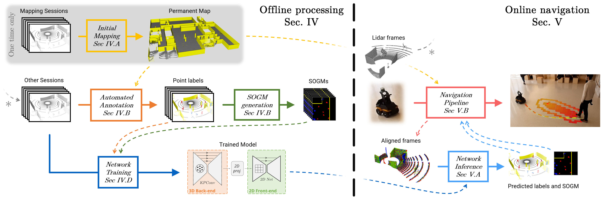

# Crystal Ball Navigation.

In this repository, we share the implementation of the paper [Like a Crystal Ball: Self-Supervised Learning to Predict the Future of Dynamic Scenes for Indoor Navigation.](https://arxiv.org/abs/2108.10585).




## Intro

We provide the full implementation used in our pipeline, it contains multiple parts: 

- Gazebo simulation
- Data processing
- Annotation of 3D lidar point clouds.
- Generation of SOGM.
- Training of our network.
- Standard navigation system.
- Standard navigation system with network inference.

Some part of the code have their own repository and are defined as git submodules here:

| Description | local path | Repository |
| :--- | :---: | :---: |
| PointMap (ROS node) | `Myhal_Simulator/nav_noetic_ws/src/point_slam` | [link](https://github.com/utiasASRL/point_slam) | 
| Modified TEB (ROS node) | `Myhal_Simulator/nav_noetic_ws/src/teb_local_planner` | [link](https://github.com/utiasASRL/teb_risk_map_planner) | 
| Navigation system | `Myhal_Simulator/onboard_deep_sogm` | [link](https://github.com/utiasASRL/onboard_deep_sogm) | 

Disclaimer: This is research code, it can be messy sometimes, not well optimized, and to make it work on different plateforms, it will probably require some debbugging. but it should work if you follow the intructions

## Data

Our real lidar dataset, UTIn3D, is available [here](https://github.com/utiasASRL/UTIn3D).

The simulated data used in the paper is available in our [old repository](https://github.com/utiasASRL/Deep-Collison-Checker).


## Usage

This is a large repository, that can do mutliple things. We provide short guides for each specific tasks:

- Task #1: [Annotate real lidar point clouds and generate SOGMs](./1_ANNOT.md)
- Task #2: [Train our network on annotated data](./2_TRAIN.md)
- Task #3: [Evaluate/Visualize the network results](./3_EVAL.md)
- Task #4: [Run navigation in the simulation with and without SOGMs](./4_NAV.md)


## References

##### Paper #1: [Self-Supervised Learning of Lidar Segmentation for Autonomous Indoor Navigation (ICRA 2021)](https://arxiv.org/pdf/2012.05897.pdf)

```
@inproceedings{thomas2021self,
  title={Self-Supervised Learning of Lidar Segmentation for Autonomous Indoor Navigation},
  author={Thomas, Hugues and Agro, Ben and Gridseth, Mona and Zhang, Jian and Barfoot, Timothy D},
  booktitle={2021 IEEE International Conference on Robotics and Automation (ICRA)},
  year={2021},
  organization={IEEE}
}
```

##### Paper #2: [Learning Spatiotemporal Occupancy Grid Maps for Lifelong Navigation in Dynamic Scenes (ICRA 2022)](https://arxiv.org/pdf/2108.10585.pdf)

```
@inproceedings{thomas2022learning,
  title={Learning Spatiotemporal Occupancy Grid Maps for Lifelong Navigation in Dynamic Scenes},
  author={Thomas, Hugues and Aurin, Matthieu Gallet de Saint and Zhang, Jian and Barfoot, Timothy D},
  booktitle={2022 IEEE International Conference on Robotics and Automation (ICRA)},
  year={2022},
  organization={IEEE}
}
```

##### Paper #3: Incoming

```
Incoming
```

## License
Our code is released under MIT License (see LICENSE file for details).
